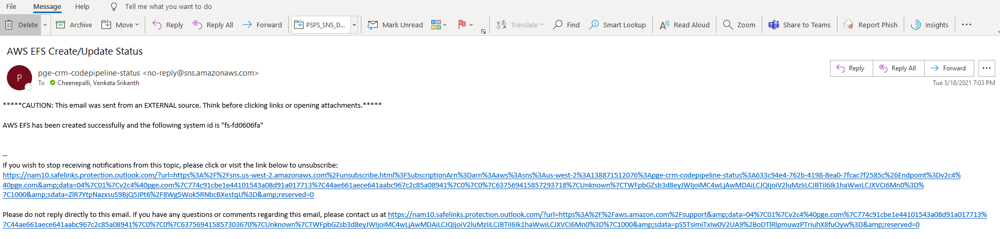
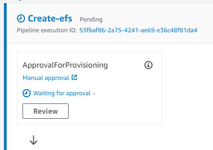
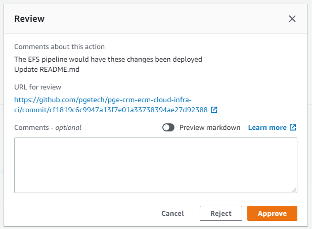
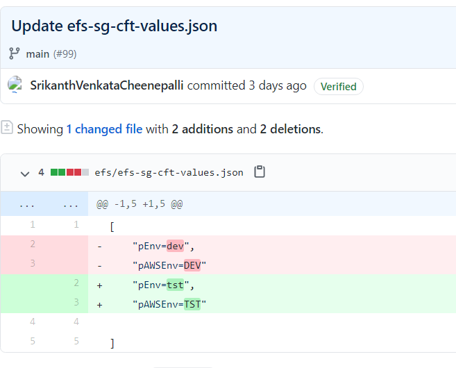
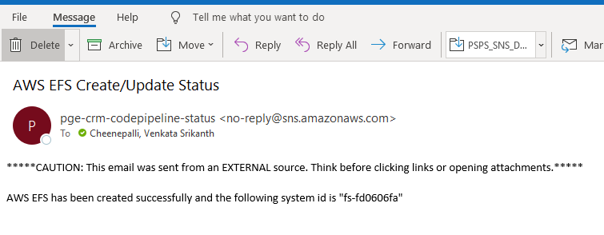

## Overview

This is a set of written instructions to set up and configure an AWS CodePipeline to provision Elastic File System in various AWS Environments


## Prerequisites

* The prerequisites mentioned in the prerequisites folder should be provisioned before executing any CloudFormation templates
    * i. kms
    * ii. s3-central-logging-bucket
    * iii. s3-codepipeline-artifact-bucket
    * iv. sns-codepipeline
    
## Directory structrue of efs
  
```
  # Contains CloudFormation Templates & buildspec files of CodePipeline & EFS 
    /
    ├── pipeline                              # Contains CloudFormation Templates & buildspec files of CodePipeline 
    |   |─── buildspec
    |        ├── efs-buildspec.yml
    |   ├── deploy.sh
    |   ├── efs-pipeline-cft-values.json
    |   ├── efs-pipeline-cft.yml   
    |   ├── sns-message.txt
    ├── README.md
    ├── efs-cft-values.json
    ├── efs-cft.yml
    ├── efs-sg-cft-values.json
    ├── efs-sg-cft.yml                       
    
 ```

## Creating Code Pipeline for the efs resource.
**Step 1**: Create a feature branch and clone this repository to your local machine and navigate to the git folder<br />
```
git clone -b feature\efs git@github.com:pgetech/pge-crm-ecm-cloud-infra-ci.git
cd pge-crm-ecm-cloud-infra-ci/efs/pipeline
```

**Step 2**: Update the deploy.sh : <br/>
The``` deploy.sh``` script is used to Deploy the specified AWS CloudFormation template by creating and then executing a change set </br>

**Step 3**. Open ```deploy.sh``` and update the following</br>
```
CF_STACK_NAME=pge-crm-efs-codepipeline-stack
CF_TEMPLATE_FILE_PATH=./efs-pipeline-cft.yml
CF_PARAMETERS_FILE_PATH=./efs-pipeline-cft-values.json
CF_TAGS_FILE_PATH=../../tags.json
AWS_PROFILE_NAME=ECM_Ops
```
**Step 4**. Update ```CF_STACK_NAME=<Name of the stack which creates CodePipeline>``` </br>
**Step 5**. Update ```CF_TEMPLATE_FILE_PATH=<Location which the CodePipeline Cloudformation template is stored>```</br>
**Step 6**. Update ```CF_PARAMETERS_FILE_PATH=<Location which the CodePipeline parameter file is stored>```</br>
**Step 7**. Update ```CF_TAGS_FILE_PATH=<Location which the CodePipeline tag detail is stored>```</br>
**Step 8**. Update ```AWS_PROFILE_NAME=<Profile used to execute the CLI Commands>```</br>
**Step 9**. Save the shell script and Run the deploy.sh script using below command <br> ```sh deploy.sh```</br>


## How to create AWS CodePipeline for a Elastic File System?

There would be one single pipeline created above which caters multiple EFS across multiple environments. Create a git feature branch for which we need to create the EFS

Skip the below steps first two steps (step 1 and step 2)if you have already done as part of the creating new pipeline

**Step 1**: Make sure that you have all the prerequisites in place. For details, please refer the prerequisites section in the prerequisites folder <br/>
**Step 2**: Create a feature branch and clone this repository to your local machine and navigate to the git folder<br />
```
git clone -b feature\efs git@github.com:pgetech/pge-crm-ecm-cloud-infra-ci.git
cd pge-crm-ecm-cloud-infra-ci/efs
```

**Step 3**: Open the EFS configuration file ```efs-cft-values.json``` <br/>
```
[   
    "pEFSType=dctm",
    "pEnv=tst",
    "pAWSEnv=TST"
]   
```   
   * Update ```pEFSType=<Name of Desired Elastic File System>  ```
   * Update ```pEnv=<Environment Name for Resource. Used if more than one resource is created in same environment[eg : dev1, dev2 etc]> ```
   * Update ```pAWSEnv=<Environment Name for Deployment> ```

**Step 4**: Open the EFS Security Group configuration file  ```efs-sg-cft-values.json```<br/>
```
[   
    "pEnv=tst",
    "pAWSEnv=TST"
]   
```   
   * Update ```pEnv=<Environment Name for Resource. Used if more than one resource is created in same environment[eg : tst1, tst2 etc]> ```
   * Update ```pAWSEnv=<Environment Name for Deployment> ```
   
**Step 5**: Save the file and commit and push the changes to the feature branch ```feature\efs```.

```
git add .
git commit -m "Creating new efs for application <name> on <ENV>"
git push
```
**Step 6**: Create a pull request from the feature branch ```feature\efs``` to branch depends on the environment to which the efs would be created and wait for the pull request reviewer to approve and merge the pull request <br />

**Step 7**: Once the pull request is merged from feature branch to environment branch, create another pull request to merge the changes to ```main branch``` which triggers the efs CodePipeline automatically <br />


**Step 8**: An Email would be sent to approve/reject the changes<br />

**Step 9**: Either click on the ```click to review``` on the email or navigate to AWS CodePipeline to review and approve the changes <br />


**Step 10**: Click on ``` Review``` on the AWS CodePipeline to review and approve the changes<br />


**Step 11**: Click on the ```URL for Review ``` to view the latest changes of the git <br />
**Step 12**: Click on Approve to run the codebuild which creates/updates new/existing EFS  <br />




**Step 13**: Email  would be sent post provision of EFS with the name of the file System and stack name<br />

