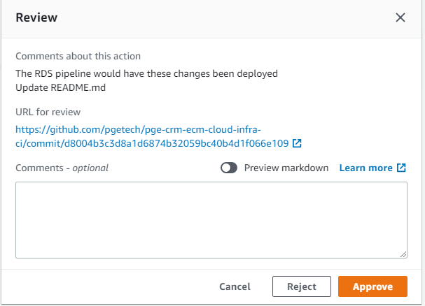
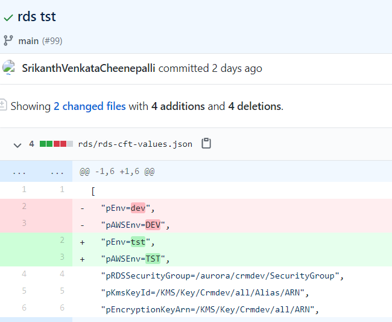
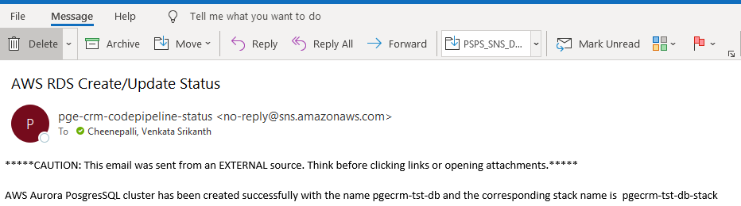

## Overview

This is a set of written instructions to set up and configure an AWS CodePipeline to provision efs Buckets in various AWS Environments


## Prerequisites

* The prerequisites mentioned in the prerequisites folder should be provisioned before executing any CloudFormation templates
    * i. kms
    * ii. s3-central-logging-bucket
    * iii. s3-codepipeline-artifact-bucket
    * iv. sns-codepipeline
## Directory structrue of rds
  
```
  # Contains CloudFormation Templates & buildspec files of CodePipeline & RDS 
    /
    ├── pipeline                              # Contains CloudFormation Templates & buildspec files of CodePipeline 
    |   |─── buildspec
    |        ├── rds-buildspec.yml
    |        ├── rds-verify-buildspec.yml
    |   ├── deploy.sh
    |   ├── rds-pipeline-cft.yml
    |   ├── rds-pipeline-cft-values.json
    |   ├── sns-message.txt
    ├── README.md
    ├── rds-cft-values.json
    ├── rds-cft.yml
    ├── rds-sg-cft-values.json
    ├── rds-sg-cft.yml
    
 ```
 


## Creating Code Pipeline for the RDS resource.
**Step 1**: Create a feature branch and clone this repository to your local machine and navigate to the git folder<br />
```
git clone -b feature\rds  git@github.com:pgetech/pge-crm-ecm-cloud-infra-ci.git
cd pge-crm-ecm-cloud-infra-ci/rds/pipeline
```

**Step 2**: Update the deploy.sh : <br/>
The``` deploy.sh``` script is used to Deploy the specified AWS CloudFormation template by creating and then executing a change set </br>

**Step 3**. Open ```deploy.sh``` and update the following</br>
```
CF_STACK_NAME=pge-crm-rds-codepipeline-stack
CF_TEMPLATE_FILE_PATH=./rds-pipeline-cft.yml
CF_PARAMETERS_FILE_PATH=./rds-pipeline-cft-values.json
CF_TAGS_FILE_PATH=../../tags.json
AWS_PROFILE_NAME=ECM_Ops
```
**Step 4**. Update ```CF_STACK_NAME=<Name of the stack which creates CodePipeline>``` </br>
**Step 5**. Update ```CF_TEMPLATE_FILE_PATH=<Location which the CodePipeline Cloudformation template is stored>```</br>
**Step 6**. Update ```CF_PARAMETERS_FILE_PATH=<Location which the CodePipeline parameter file is stored>```</br>
**Step 7**. Update ```CF_TAGS_FILE_PATH=<Location which the CodePipeline tag detail is stored>```</br>
**Step 8**. Update ```AWS_PROFILE_NAME=<Profile used to execute the CLI Commands>```</br>
**Step 9**. Save the shell script and Run the deploy.sh script using below command <br> ```sh deploy.sh```</br>


## How to create AWS CodePipeline for a rds Resource?

There would be one single pipeline created above which caters multiple rds 
across multiple environments. Create a git feature branch for which we need to create the rds 

Skip the below steps first two steps (step 1 and step 2)if you have already done as part of the creating new pipeline

**Step 1**: Make sure that you have all the prerequisites in place. For details, please refer the pre-requisites section above <br />
**Step 2**: Create a feature branch and clone this repository to your local machine and navigate to the git folder<br />
```
git clone -b feature\rds git@github.com:pgetech/pge-crm-ecm-cloud-infra-ci.git
cd pge-crm-ecm-cloud-infra-ci/rds
```

**Step 3**: Open the rds configuration file ``` rds-cft-values.json``` update the name of the desired rds
for the application and pAWSEnv the environment where the DB needs to be created <br />

     [
        "prdDBName=pge-crm-rds-<Name of the DB>-<Env>",
        "pAWSEnv=TST",
        "pVersioning=false",
        "pKMSMasterKeyID=/KMS/Key/Crmdev/all/Alias/ARN"
    ]  
    
**Step 4**: Save the file and commit and push the changes to the feature branch ```feature\rds```.

```
git add .
git commit -m "Creating new rds DB for application <name> on <ENV>"
git push
```
**Step 5**: Create a pull request from the feature branch ```feature\rds``` to branch depends on the environemnt to which the rds  would be created and wait for the pull request reviewer to approve and merge the pull request <br />

**Step 6**: Once the pull request is merged from feature branch to enviornment branch, create another pull request to merge the changes to ```main branch``` which triggers the rds CodePipeline automatically <br />


**Step 7**: An Email would be sent to approve/reject the changes<br />

**Step 8**: Either click on the ```click to review``` on the email or navigate to AWS CodePipeline to review and approve the changes <br />

**Step 9**: Click on ``` Review``` on the AWS CodePipeline to review and approve the changes<br />


**Step 10**: Click on the ```URL fore review ``` to view the latest changes of the git <br />
**Step 11**: Click on Approve to run the codebuild which creates/updates new/existing rds   <br />




**Step 12**: Email  would be sent post provision of rds with the name of the  and stack name<br />

