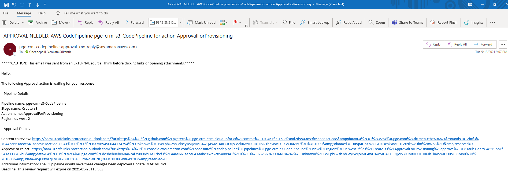
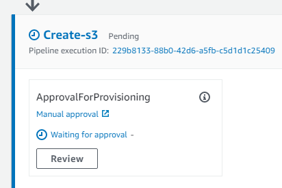
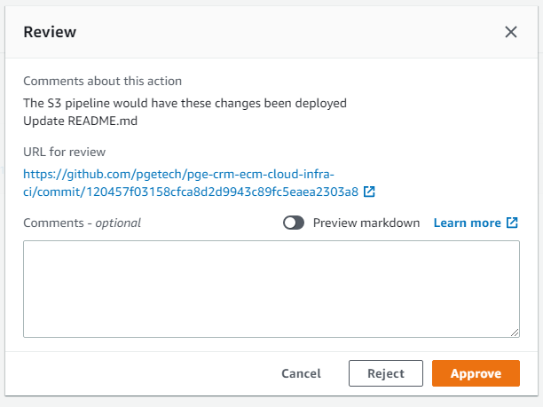
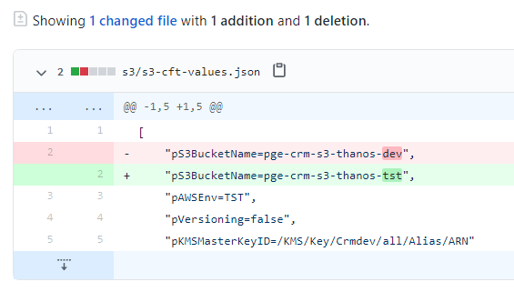
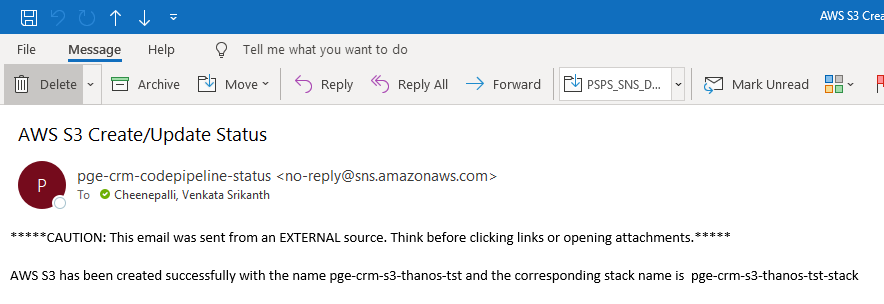

## Overview

This is a set of written instructions to set up and configure an AWS CodePipeline to provision S3 Buckets in various AWS Environments

## Prerequisites

* The prerequisites mentioned in the prerequisites folder should be provisioned before executing any CloudFormation templates
    * i. kms
    * ii. s3-central-logging-bucket
    * iii. s3-codepipeline-artifact-bucket
    * iv. sns-codepipeline
   #### * AWS S3 CloudFormation Template: s3-cft.yml
   #### * AWS S3 values.json: s3-cft-values.json
   #### * AWS CodePipeline CloudFormation Template: s3-pipeline-cft.yml
   #### * AWS CodePipeline values.json: s3-pipeline-cft-values.json
   #### * AWS S3 values.json: s3-cft-values.json


## Creating Code Pipeline for the S3 Bucket.
**Step 1**: Create a feature branch and clone this repository to your local machine and navigate to the git folder<br />
```
git clone -b feature\s3bucket git@github.com:pgetech/pge-crm-ecm-cloud-infra-ci.git
cd pge-crm-ecm-cloud-infra-ci/s3/pipeline
```

**Step 2**: Update the deploy.sh : <br/>
The``` deploy.sh``` script is used to Deploy the specified AWS CloudFormation template by creating and then executing a change set </br>

**Step 3**. Open ```deploy.sh``` and update the following</br>
```
CF_STACK_NAME=pge-crm-s3-codepipeline-stack
CF_TEMPLATE_FILE_PATH=./s3-pipeline-cft.yml
CF_PARAMETERS_FILE_PATH=./s3-pipeline-cft-values.json
CF_TAGS_FILE_PATH=../../tags.json
AWS_PROFILE_NAME=ECM_Ops
```
**Step 4**. Update ```CF_STACK_NAME=<Name of the stack which creates CodePipeline>``` </br>
**Step 5**. Update ```CF_TEMPLATE_FILE_PATH=<Location which the CodePipeline Cloudformation template is stored>```</br>
**Step 6**. Update ```CF_PARAMETERS_FILE_PATH=<Location which the CodePipeline parameter file is stored>```</br>
**Step 7**. Update ```CF_TAGS_FILE_PATH=<Location which the CodePipeline tag detail is stored>```</br>
**Step 8**. Update ```AWS_PROFILE_NAME=<Profile used to execute the CLI Commands>```</br>
**Step 9**. Save the shell script and Run the deploy.sh script using below command <br> ```sh deploy.sh```</br>


## How to create S3 Bucket using CICD AWS CodePipeline?

There would be one single pipeline created above which caters multiple S3 buckets across multiple environments. Create a git feature branch for which we need to create the S3 bucket

Skip the below first two steps (step 1 and step 2) if you have already created and clone the feature branch as part of the creating new pipeline

**Step 1**: Make sure that you have all the prerequisites in place. For details, please refer the pre-requisites section above <br />
**Step 2**: Create a feature branch (ex: feature\s3bucket) from main and clone the repository to your local machine and navigate to the git folder<br />
```
git clone -b feature\s3bucket git@github.com:pgetech/pge-crm-ecm-cloud-infra-ci.git
cd pge-crm-ecm-cloud-infra-ci/s3
```

**Step 3**: Open the s3 configuration file ``` s3-cft-values.json``` update the name of the desired bucket for the application and pAWSEnv the environment where the bucket needs to be created <br />

     [
       "pS3BucketName=pge-crm-s3-dctm-alb-logs-dev", #Mention the name of the S3 bucket.
       "pAWSEnv=DEV", #Parameter used to provision the resource in specific env.
       "pVersioning=false",   #Parameter to disable Versioning.
       "pKMSMasterKeyID=/KMS/Key/Crmdev/all/Alias/ARN",  #Mandatory if KMS is required, mention the KMS KeyID  
       "pEncryptionType=aws:sse",   #Optional parameter to change bucket data encryption to SSE. Default encryption is KMS      
       "pExpirationInDays=30",   #Optional parameter mention this if you need the Lifecycle of the objects.
       "s3bktpolicy=s3/scripts/s3-bkt-policy.json"  #Optional parameter if mentioned it will add the bucket policy to the bucket provided the policy exists in the scripts folder.
      ]  
  *S3 bucket policies must be uploaded to ```s3/scripts folder```*
  
**Step 4**: Save the file and commit and push the changes to the feature branch ```feature\s3bucket```.

```
git add .
git commit -m "Creating new s3 bucket for application <name> on <ENV>"
git push
```
**Step 5**: Create a pull request from the feature branch ```feature\s3bucket``` to branch depends on the environment to which the s3 bucket would be created and wait for the pull request reviewer to approve and merge the pull request <br />

**Step 6**: Once the pull request is merged from feature branch to environment branch, create another pull request to merge the changes to ```main branch``` which triggers the S3 CodePipeline automatically <br />


**Step 7**: An Email would be sent to approve/reject the changes<br />

**Step 8**: Either click on the ```click to review``` on the email or navigate to AWS CodePipeline to review and approve the changes <br />


**Step 9**: Click on ``` Review``` on the AWS CodePipeline to review and approve the changes<br />


**Step 10**: Click on the ```URL fore review ``` to view the latest changes of the git <br />
**Step 11**: Click on Approve to run the codebuild which creates/updates new/existing s3 bucket  <br />




**Step 12**: Email  would be sent post provision of S3 with the name of the bucket and stack name<br />


  
  
